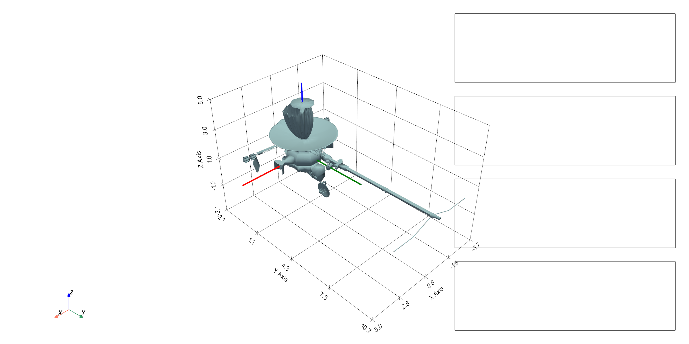

# hybrid-attitude-control
Simulation and visualization of hybrid spacecraft attitude control using quaternions, rigid-body dynamics, and hybrid control laws for global attitude stabilization.

<p align="center">
  
</p>

The visualization shows the spacecraft attitude evolution together with the
logic variable, quaternion state, angular velocity, and cumulative control
effort.

## Overview

This project implements and visualizes hybrid attitude control algorithms for
rigid spacecraft using unit quaternions and nonlinear rigid-body dynamics.

The implementation is based on the hybrid control framework proposed by
Mayhew, Sanfelice, and Teel [1] for robust global asymptotic attitude
stabilization.

The project explores several key concepts in nonlinear and hybrid control,
including:

- Quaternion-based attitude representation and kinematics
- Nonlinear rigid-body rotational dynamics
- Lyapunov-based stability analysis
- Hybrid dynamical systems with continuous flows and discrete jumps
- Hysteresis-based switching logic
- Global asymptotic attitude stabilization
- Avoidance of the quaternion unwinding phenomenon
- Energy-based nonlinear attitude control
- Backstepping control
- Robustness against quaternion measurement noise
- Chattering and the effect of hysteresis
- Control-effort analysis
- Comparison of different hybrid controller configurations
- Synchronized 3D spacecraft visualization using PyVista

The project combines mathematical modelling, nonlinear control theory,
numerical simulation, and 3D visualization to provide both a technical
implementation and an intuitive demonstration of hybrid spacecraft attitude
control.

This repository is designed as both:

- a technical simulation project
- a research-oriented visual demonstrator for hybrid nonlinear control

## Motivation

Classical continuous attitude controllers on SO(3) face topological limitations that prevent global asymptotic stabilization using smooth feedback alone.

Hybrid control overcomes this issue by introducing a discrete logic variable that enables global stabilization without unwinding.

This project aims to provide an intuitive and visual implementation of these ideas for engineering, learning, and research purposes.

## Mathematical Model

### Attitude Representation

The spacecraft attitude is represented using unit quaternions:

```math
q = (\eta, \epsilon) \in \mathbb{S}^3
```

where:

- $\eta$ is the scalar part
- $\epsilon$ is the vector part

### Kinematics

```math
\dot{q} = \frac{1}{2} q \otimes \nu(\omega)
```

where:

- $\omega$ is the angular velocity
- $\otimes$ denotes quaternion multiplication

### Rigid-Body Dynamics

```math
J\dot{\omega} = -\omega \times J\omega + \tau
```

where:

- $J$ is the inertia matrix
- $\tau$ is the control torque

### Continuous Control Laws

Two nonlinear control laws are implemented for the rigid-body dynamics.

#### Energy-Based Controller

The energy-based controller applies the control torque

```math
\tau = -c h \epsilon - K_\omega \omega
```

where $c > 0$ and $K_\omega$ is a positive-definite gain matrix.

The first term provides quaternion-based attitude feedback, while the second introduces angular-velocity damping.

#### Backstepping Controller

The backstepping controller introduces the auxiliary variable

```math
z = \omega + h K_\epsilon \epsilon
```

and applies the control torque

```math
\tau =
-S(J\omega)\omega
-\frac{h}{2} J K_\epsilon
\left(\eta I + S(\epsilon)\right)\omega
-K_z z
-c h \epsilon
```

where $K_\epsilon$ and $K_z$ are positive-definite gain matrices.

This controller extends the stabilizing quaternion kinematic feedback to the full rigid-body dynamics using a backstepping design.

### Hybrid Logic

A binary logic variable is introduced:

```math
h \in \{-1,1\}
```

For the energy-based controller, the flow and jump sets are defined by

```math
C = \{(q,h): h\eta \geq -\delta\}
```

```math
D = \{(q,h): h\eta \leq -\delta\}
```

with jump map

```math
h^+ = -h
```

The hybrid switching mechanism is the key element that prevents quaternion unwinding. By allowing the discrete logic variable $h$ to switch between the two equivalent quaternion representations of the same physical attitude, the controller can select the appropriate equilibrium without forcing an unnecessary full rotation.

The hysteresis parameter $\delta$ defines the switching threshold and improves robustness by preventing excessive switching (chattering) in the presence of measurement noise. Thus, the combination of continuous nonlinear feedback and discrete switching logic provides the hybrid control mechanism used to achieve robust global asymptotic attitude stabilization.


## References

[1] C. G. Mayhew, R. G. Sanfelice, and A. R. Teel,
"Robust global asymptotic attitude stabilization of a rigid body by
quaternion-based hybrid feedback," 2009.